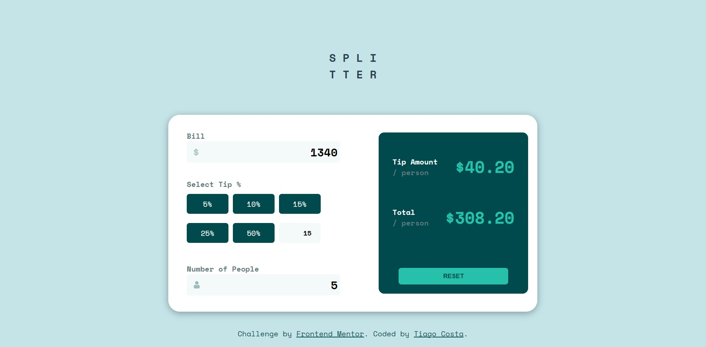

# Frontend Mentor - Tip calculator app solution

This is a solution to the [Tip calculator app challenge on Frontend Mentor](https://www.frontendmentor.io/challenges/tip-calculator-app-ugJNGbJUX). Frontend Mentor challenges help you improve your coding skills by building realistic projects.

## Overview

### The challenge

Users should be able to:

- View the optimal layout for the app depending on their device's screen size
- See hover states for all interactive elements on the page
- Calculate the correct tip and total cost of the bill per person

### Screenshot

### Links

- Live Site URL: [Hosted on Netlify](https://splitterapp.netlify.app/#/)

### Built with

- Semantic HTML5 markup
- CSS custom properties
- Flexbox
- [Vue3](https://v3.vuejs.org/) - JS library
- [SASS](https://sass-lang.com/) - CSS extension

## Author

- Website - [Tiago Costa](https://www.tiagocostadev.com/#/)
- Frontend Mentor - [@MrValraven](https://www.frontendmentor.io/profile/MrValraven)

## Acknowledgments

A special thanks to Leo and Mirti for having the patience of hearing me rambling about all the silly bugs I find during the development of my projects.
